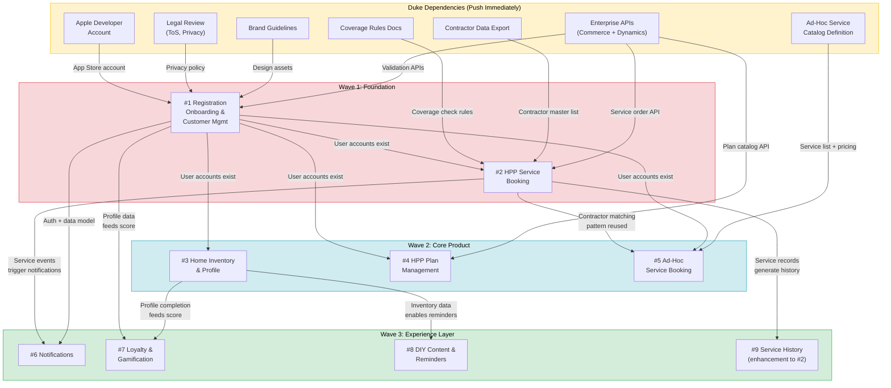

# Discovery Roadmap — Visual Diagrams

## 1. Timeline Gantt Chart

Shows the rolling wave approach: discovery → PRDs → design → dev, with overlapping waves.

```mermaid
gantt
    title Discovery & Development Roadmap — Phase 1 / MVP
    dateFormat YYYY-MM-DD
    axisFormat Week %W

    section Kickoff
    Internal team kickoff                       :kick, 2026-04-06, 5d

    section Wave 1 Discovery
    Session 1: Registration & Onboarding        :crit, w1s1, 2026-04-13, 3d
    Session 2: HPP Service Booking              :crit, w1s2, 2026-04-16, 5d

    section Wave 1 Outputs
    Wave 1 PRDs produced                        :w1prd, 2026-04-27, 10d
    Wave 1 design starts                        :w1d, 2026-04-20, 10d

    section Wave 1 Dev
    Technical foundation (auth, CI/CD, schema)  :w1tf, 2026-04-20, 10d
    Registration & service booking dev          :w1dev, 2026-04-27, 20d

    section Wave 2 Discovery
    Session 3: Home Inventory                   :active, w2s3, 2026-04-27, 3d
    Session 4: HPP Plan Management              :w2s4, 2026-04-30, 5d
    Session 5: Ad-Hoc Services                  :w2s5, 2026-05-04, 5d

    section Wave 2 Outputs
    Wave 2 PRDs produced                        :w2prd, 2026-05-11, 10d
    Wave 2 design starts                        :w2d, 2026-05-11, 15d

    section Wave 2 Dev
    Inventory, plans, ad-hoc dev                :w2dev, 2026-05-25, 25d

    section Wave 3 Discovery
    Session 6: Notifications + Loyalty + DIY    :w3s6, 2026-05-18, 5d

    section Wave 3 Outputs
    Wave 3 PRDs produced                        :w3prd, 2026-05-25, 10d

    section Wave 3 Dev
    Notifications, loyalty, content dev         :w3dev, 2026-06-08, 20d

    section Ongoing
    Refinement sessions as needed               :after w3s6, 30d
```

## 2. Dependency Flowchart

Shows which deliverables block which, and what Duke must provide.



## How to Render These

**GitHub:** Mermaid renders natively in `.md` files on GitHub.

**Confluence:** Install the "Mermaid Diagrams for Confluence" app from the Atlassian Marketplace, then paste the mermaid code into a Mermaid macro block.

**Standalone:** Use [mermaid.live](https://mermaid.live) to paste the code and export as SVG or PNG.

**VS Code:** Install the "Markdown Preview Mermaid Support" extension to preview in the editor.
