# Admin Portal - Workflow Diagrams

**Date Created:** November 19, 2025
**Last Updated:** November 22, 2025
**Purpose:** Visual flow diagrams for key admin workflows in the Duke Energy Admin Portal

---

## Document Updates (November 22, 2025)

**This document has been updated to align with the expanded Admin Portal Preliminary Scope document.**

### Major Changes:

1. **Workflow 2 - Service Request Management**: Completely rewritten to reflect **manual service request processing** for MVP
   - Admin manually contacts contractors within 1 hour SLA
   - Contractors respond within 24 hours (accept/propose alternative/decline)
   - Admin updates app status based on contractor responses
   - No FSM integration for MVP (no real-time GPS, contractor mobile app, or automated status updates)
   - Added detailed flowcharts for all scenarios

2. **NEW Workflow 8 - Contractor Configuration Management**: Critical new workflow from Session 3
   - Managing 125-140 contractors across 4-5 states
   - Multi-trade contractor support (contractors offer 2-3 trades)
   - Zip code based matching (NOT radius-based)
   - Trade-specific lead time buffers (HVAC: 1-2 days, Plumbing: 3-5 days, Electrical: 5-6 days)
   - Primary/secondary contractor designation per trade + zip code
   - Static availability rules (MVP - no real-time calendars)
   - Emergency override/exception handling
   - Three scenarios: Create new contractor, Edit existing, Emergency overrides

3. **System Integration Flow**: Updated to include contractor configuration data
   - Added contractor master data from Duke CRM
   - App backend houses local copy of contractor config
   - Manual sync strategy for MVP (as-needed, ~1-2 updates/year)

4. **Admin Permission Levels**: Expanded Operations Manager role
   - Added contractor configuration CRUD access
   - Added manual service request processing permissions
   - Added contractor availability override capabilities

5. **Cross-Workflow Integration Map**: Updated to show contractor configuration workflow integration
   - Service Request workflow depends on Contractor Configuration
   - Operations Manager role now central to service request processing

6. **Summary Section**: Updated from 7 to 8 core workflows
   - Added critical success factors for manual MVP workflows
   - Highlighted contractor configuration as new critical component

### Why These Changes Matter:

- **Manual MVP Approach**: Without FSM tool integration, Operations Manager becomes critical bottleneck. 1-hour SLA must be met for service request processing.
- **Contractor Configuration Complexity**: Multi-trade, non-contiguous zip code coverage, and trade-specific availability windows require sophisticated admin interface.
- **Matching Algorithm Dependencies**: Customer-facing scheduling calendar depends on accurate contractor configuration data in admin backend.

---

## Table of Contents

1. [Manual Enrollment Processing (MVP Fallback)](#workflow-1-manual-enrollment-processing)
2. [Service Request Creation & Manual Processing (MVP)](#workflow-2-service-request-creation--manual-processing-mvp)
3. [Ad-Hoc Service Catalog Creation](#workflow-3-ad-hoc-service-catalog-creation)
4. [Reminder Management](#workflow-4-reminder-management)
5. [Customer Profile Management (Support Call)](#workflow-5-customer-profile-management)
6. [Inventory Management (Contractor Update)](#workflow-6-inventory-management)
7. [Analytics Review (Weekly Business Review)](#workflow-7-analytics-review)
8. [Contractor Configuration Management](#workflow-8-contractor-configuration-management)

---

## Workflow 1: Manual Enrollment Processing

**Purpose:** When enrollment API doesn't exist, admin manually processes HPP plan enrollments submitted via app.

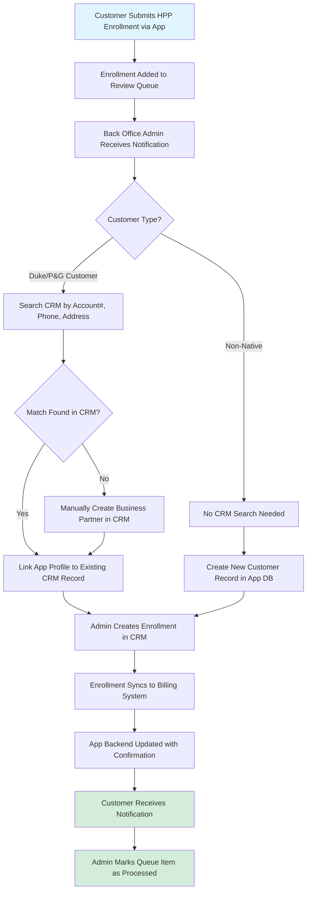
```mermaid
flowchart TD
    A[Customer Submits HPP Enrollment via App] --> B[Enrollment Added to Review Queue]
    B --> C[Back Office Admin Receives Notification]
    C --> D{Customer Type?}

    D -->|Duke/P&G Customer| E[Search CRM by Account#, Phone, Address]
    D -->|Non-Native| M[No CRM Search Needed]

    E --> F{Match Found in CRM?}
    F -->|Yes| G[Link App Profile to Existing CRM Record]
    F -->|No| H[Manually Create Business Partner in CRM]

    H --> G
    M --> N[Create New Customer Record in App DB]

    G --> I[Admin Creates Enrollment in CRM]
    N --> I

    I --> J[Enrollment Syncs to Billing System]
    J --> K[App Backend Updated with Confirmation]
    K --> L[Customer Receives Notification]
    L --> O[Admin Marks Queue Item as Processed]

    style A fill:#e1f5ff
    style L fill:#d4edda
    style O fill:#d4edda
```

**Timeline:** 24-48 hours from submission to completion

---

## Workflow 2: Service Request Creation & Manual Processing (MVP)

### Scenario A: Customer Books Service via App - Manual Processing Workflow

**CRITICAL MVP WORKFLOW - Admin manually contacts contractors within 1 hour**

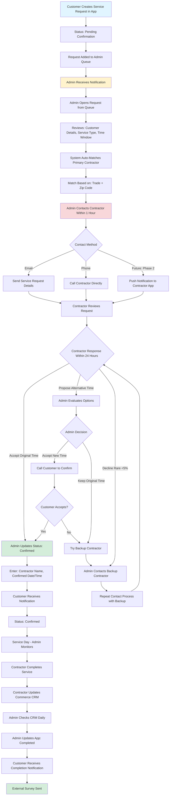
```mermaid
flowchart TD
    A[Customer Creates Service Request in App] --> B[Status: Pending Confirmation]
    B --> C[Request Added to Admin Queue]
    C --> D[Admin Receives Notification]

    D --> E[Admin Opens Request from Queue]
    E --> E1[Reviews: Customer Details, Service Type, Time Window]
    E1 --> F[System Auto-Matches Primary Contractor]
    F --> F1[Match Based on: Trade + Zip Code]

    F1 --> G[Admin Contacts Contractor Within 1 Hour]
    G --> G1{Contact Method}

    G1 -->|Email| H1[Send Service Request Details]
    G1 -->|Phone| H2[Call Contractor Directly]
    G1 -->|Future: Phase 2| H3[Push Notification to Contractor App]

    H1 --> I[Contractor Reviews Request]
    H2 --> I
    H3 --> I

    I --> J{Contractor Response Within 24 Hours}

    J -->|Accept Original Time| K1[Admin Updates Status: Confirmed]
    J -->|Propose Alternative Time| L1[Admin Evaluates Options]
    J -->|Decline Rare <5%| M1[Admin Contacts Backup Contractor]

    K1 --> K2[Enter: Contractor Name, Confirmed Date/Time]
    K2 --> K3[Customer Receives Notification]
    K3 --> N[Status: Confirmed]

    L1 --> L2{Admin Decision}
    L2 -->|Accept New Time| L3[Call Customer to Confirm]
    L2 -->|Keep Original Time| L4[Try Backup Contractor]

    L3 --> L5{Customer Accepts?}
    L5 -->|Yes| K1
    L5 -->|No| L4

    L4 --> M1
    M1 --> M2[Repeat Contact Process with Backup]
    M2 --> J

    N --> O[Service Day - Admin Monitors]
    O --> P[Contractor Completes Service]
    P --> Q[Contractor Updates Commerce CRM]
    Q --> R[Admin Checks CRM Daily]
    R --> S[Admin Updates App: Completed]
    S --> T[Customer Receives Completion Notification]
    T --> U[External Survey Sent]

    style A fill:#e1f5ff
    style D fill:#fff3cd
    style G fill:#f8d7da
    style K1 fill:#d4edda
    style U fill:#d4edda
```

**Target SLAs:**
- Admin processes request: Within 1 hour
- Contractor responds: Within 24 hours
- Admin updates app: Within 1 hour of contractor response
- Total time to confirmation: 24-48 hours

### Scenario B: HPP Covered Service (Simpler Flow)

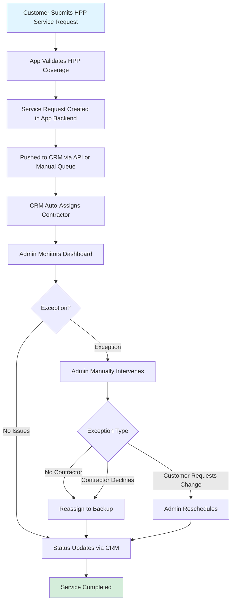
```mermaid
flowchart TD
    A[Customer Submits HPP Service Request] --> B[App Validates HPP Coverage]
    B --> C[Service Request Created in App Backend]
    C --> D[Pushed to CRM via API or Manual Queue]
    D --> E[CRM Auto-Assigns Contractor]
    E --> F[Admin Monitors Dashboard]
    F --> G{Exception?}

    G -->|No Issues| H[Status Updates via CRM]
    G -->|Exception| I[Admin Manually Intervenes]

    I --> I1{Exception Type}
    I1 -->|No Contractor| I2[Reassign to Backup]
    I1 -->|Contractor Declines| I2
    I1 -->|Customer Requests Change| I3[Admin Reschedules]

    I2 --> H
    I3 --> H
    H --> J[Service Completed]

    style A fill:#e1f5ff
    style J fill:#d4edda
```

### Scenario C: Customer Calls to Book Service (Phone Order)

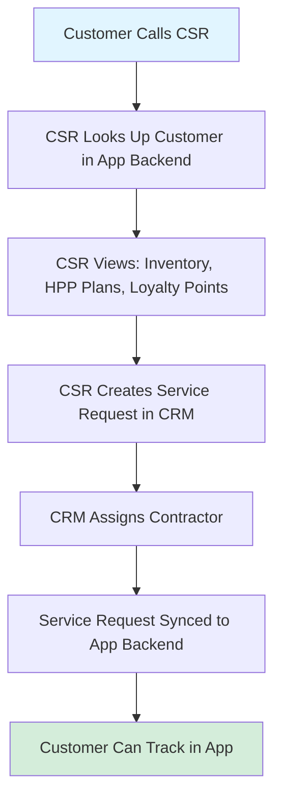
```mermaid
flowchart TD
    A[Customer Calls CSR] --> B[CSR Looks Up Customer in App Backend]
    B --> C[CSR Views: Inventory, HPP Plans, Loyalty Points]
    C --> D[CSR Creates Service Request in CRM]
    D --> E[CRM Assigns Contractor]
    E --> F[Service Request Synced to App Backend]
    F --> G[Customer Can Track in App]

    style A fill:#e1f5ff
    style G fill:#d4edda
```

---

## Workflow 3: Ad-Hoc Service Catalog Creation

**Actor:** Product Manager

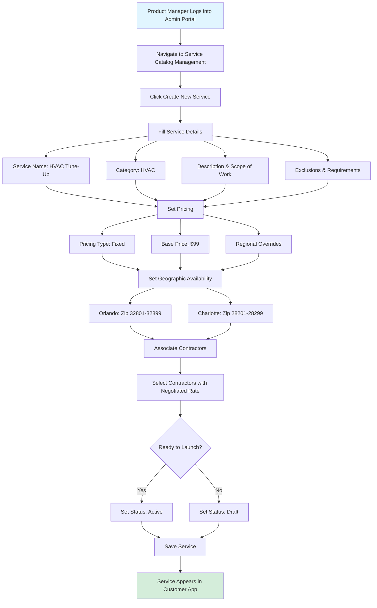
```mermaid
flowchart TD
    A[Product Manager Logs into Admin Portal] --> B[Navigate to Service Catalog Management]
    B --> C[Click Create New Service]
    C --> D[Fill Service Details]

    D --> D1[Service Name: HVAC Tune-Up]
    D --> D2[Category: HVAC]
    D --> D3[Description & Scope of Work]
    D --> D4[Exclusions & Requirements]

    D1 --> E[Set Pricing]
    D2 --> E
    D3 --> E
    D4 --> E

    E --> E1[Pricing Type: Fixed]
    E --> E2[Base Price: $99]
    E --> E3[Regional Overrides]

    E1 --> F[Set Geographic Availability]
    E2 --> F
    E3 --> F

    F --> F1[Orlando: Zip 32801-32899]
    F --> F2[Charlotte: Zip 28201-28299]

    F1 --> G[Associate Contractors]
    F2 --> G

    G --> G1[Select Contractors with Negotiated Rate]

    G1 --> H{Ready to Launch?}
    H -->|Yes| I[Set Status: Active]
    H -->|No| J[Set Status: Draft]

    I --> K[Save Service]
    J --> K

    K --> L[Service Appears in Customer App]

    style A fill:#e1f5ff
    style L fill:#d4edda
```

**Result:** Service now bookable by customers in app

---

## Workflow 4: Reminder Management

**Actor:** Product Manager / Content Manager

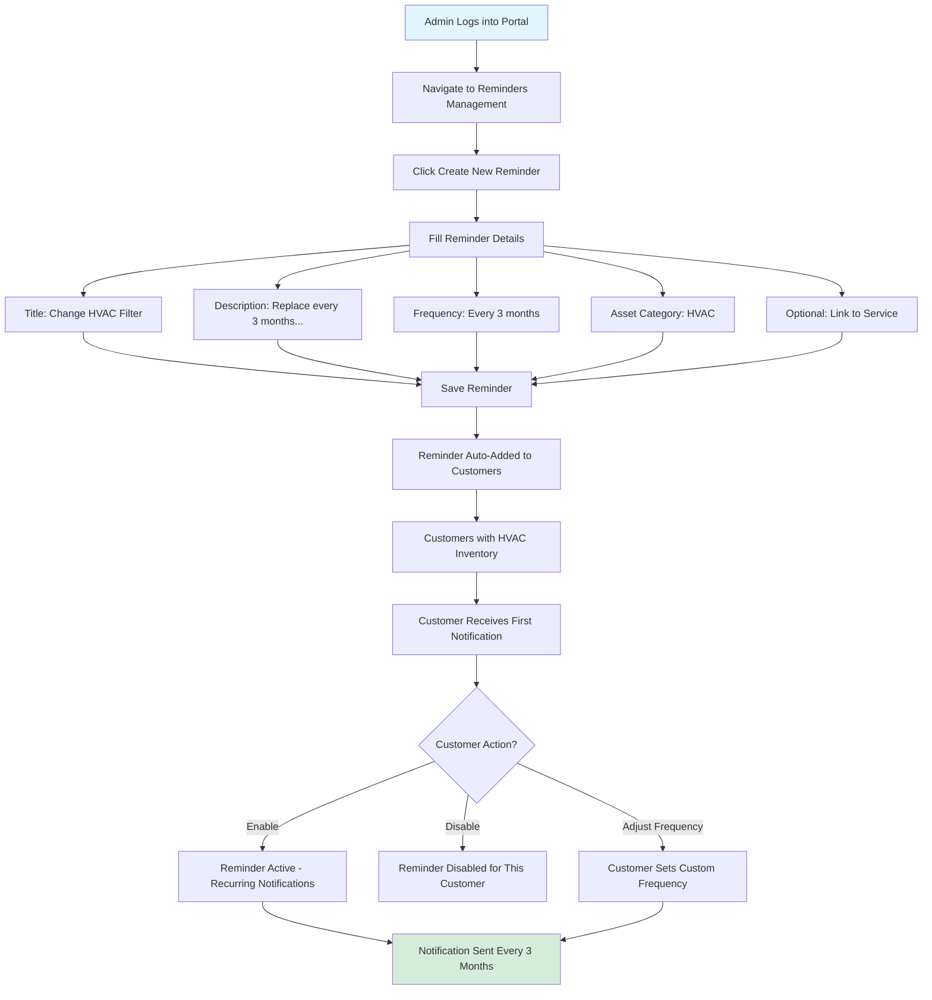
```mermaid
flowchart TD
    A[Admin Logs into Portal] --> B[Navigate to Reminders Management]
    B --> C[Click Create New Reminder]
    C --> D[Fill Reminder Details]

    D --> D1[Title: Change HVAC Filter]
    D --> D2[Description: Replace every 3 months...]
    D --> D3[Frequency: Every 3 months]
    D --> D4[Asset Category: HVAC]
    D --> D5[Optional: Link to Service]

    D1 --> E[Save Reminder]
    D2 --> E
    D3 --> E
    D4 --> E
    D5 --> E

    E --> F[Reminder Auto-Added to Customers]
    F --> G[Customers with HVAC Inventory]
    G --> H[Customer Receives First Notification]
    H --> I{Customer Action?}

    I -->|Enable| J[Reminder Active - Recurring Notifications]
    I -->|Disable| K[Reminder Disabled for This Customer]
    I -->|Adjust Frequency| L[Customer Sets Custom Frequency]

    J --> M[Notification Sent Every 3 Months]
    L --> M

    style A fill:#e1f5ff
    style M fill:#d4edda
```

**Customer Experience:** Automatic reminders based on inventory, fully customizable

---

## Workflow 5: Customer Profile Management

**Scenario:** Customer can't log into app (Support Call)

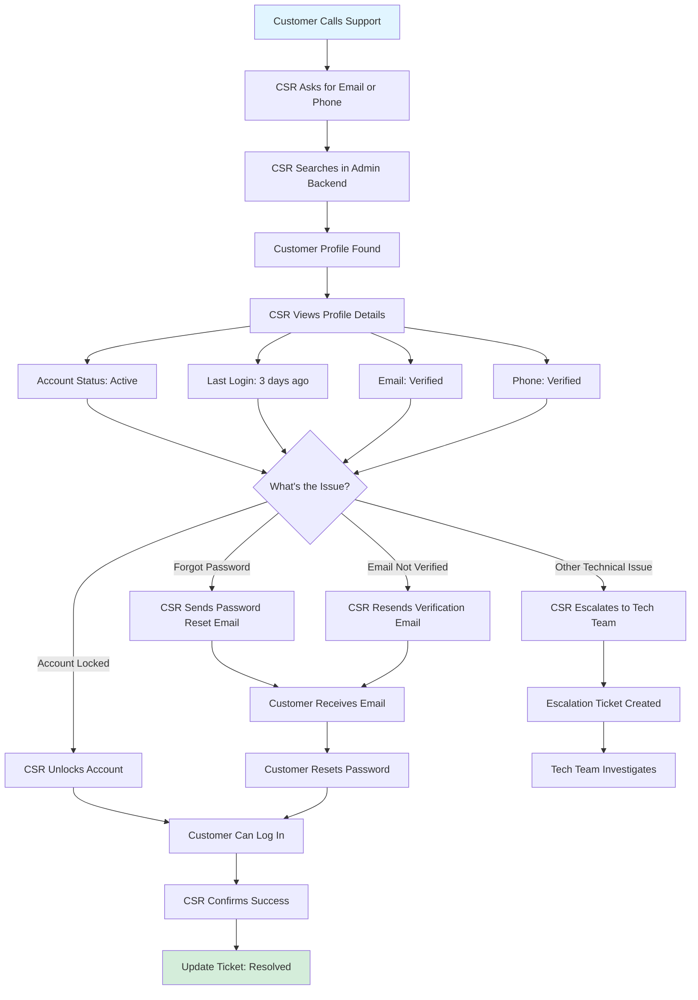
```mermaid
flowchart TD
    A[Customer Calls Support] --> B[CSR Asks for Email or Phone]
    B --> C[CSR Searches in Admin Backend]
    C --> D[Customer Profile Found]
    D --> E[CSR Views Profile Details]

    E --> E1[Account Status: Active]
    E --> E2[Last Login: 3 days ago]
    E --> E3[Email: Verified]
    E --> E4[Phone: Verified]

    E1 --> F{What's the Issue?}
    E2 --> F
    E3 --> F
    E4 --> F

    F -->|Forgot Password| G[CSR Sends Password Reset Email]
    F -->|Account Locked| H[CSR Unlocks Account]
    F -->|Email Not Verified| I[CSR Resends Verification Email]
    F -->|Other Technical Issue| J[CSR Escalates to Tech Team]

    G --> K[Customer Receives Email]
    H --> L[Customer Can Log In]
    I --> K

    K --> M[Customer Resets Password]
    M --> L

    L --> N[CSR Confirms Success]
    N --> O[Update Ticket: Resolved]

    J --> P[Escalation Ticket Created]
    P --> Q[Tech Team Investigates]

    style A fill:#e1f5ff
    style O fill:#d4edda
```

**Resolution Time:** Typical: 5-10 minutes. Complex issues escalated.

---

## Workflow 6: Inventory Management

**Scenario:** Contractor updates customer inventory after service visit

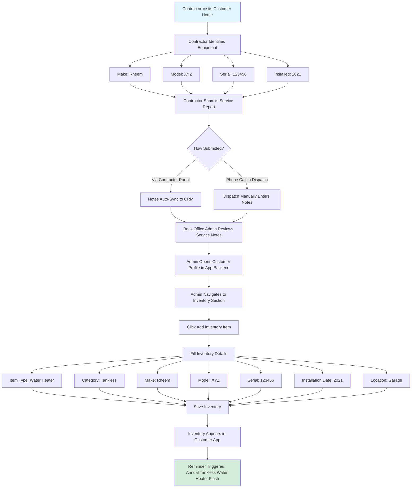
```mermaid
flowchart TD
    A[Contractor Visits Customer Home] --> B[Contractor Identifies Equipment]
    B --> B1[Make: Rheem]
    B --> B2[Model: XYZ]
    B --> B3[Serial: 123456]
    B --> B4[Installed: 2021]

    B1 --> C[Contractor Submits Service Report]
    B2 --> C
    B3 --> C
    B4 --> C

    C --> D{How Submitted?}
    D -->|Via Contractor Portal| E[Notes Auto-Sync to CRM]
    D -->|Phone Call to Dispatch| F[Dispatch Manually Enters Notes]

    E --> G[Back Office Admin Reviews Service Notes]
    F --> G

    G --> H[Admin Opens Customer Profile in App Backend]
    H --> I[Admin Navigates to Inventory Section]
    I --> J[Click Add Inventory Item]

    J --> K[Fill Inventory Details]
    K --> K1[Item Type: Water Heater]
    K --> K2[Category: Tankless]
    K --> K3[Make: Rheem]
    K --> K4[Model: XYZ]
    K --> K5[Serial: 123456]
    K --> K6[Installation Date: 2021]
    K --> K7[Location: Garage]

    K1 --> L[Save Inventory]
    K2 --> L
    K3 --> L
    K4 --> L
    K5 --> L
    K6 --> L
    K7 --> L

    L --> M[Inventory Appears in Customer App]
    M --> N[Reminder Triggered: Annual Tankless Water Heater Flush]

    style A fill:#e1f5ff
    style N fill:#d4edda
```

**Benefit:** Customer now has complete inventory, receives proactive maintenance reminders

---

## Workflow 7: Analytics Review

**Scenario:** Weekly business review meeting

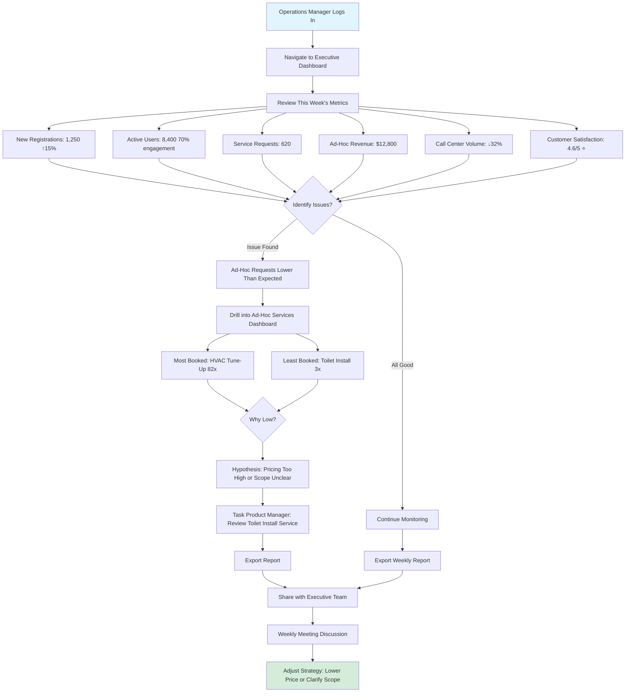
```mermaid
flowchart TD
    A[Operations Manager Logs In] --> B[Navigate to Executive Dashboard]
    B --> C[Review This Week's Metrics]

    C --> C1[New Registrations: 1,250 ↑15%]
    C --> C2[Active Users: 8,400 70% engagement]
    C --> C3[Service Requests: 620]
    C --> C4[Ad-Hoc Revenue: $12,800]
    C --> C5[Call Center Volume: ↓32%]
    C --> C6[Customer Satisfaction: 4.6/5 ⭐]

    C1 --> D{Identify Issues?}
    C2 --> D
    C3 --> D
    C4 --> D
    C5 --> D
    C6 --> D

    D -->|Issue Found| E[Ad-Hoc Requests Lower Than Expected]
    D -->|All Good| R[Continue Monitoring]

    E --> F[Drill into Ad-Hoc Services Dashboard]
    F --> G[Most Booked: HVAC Tune-Up 82x]
    F --> H[Least Booked: Toilet Install 3x]

    G --> I{Why Low?}
    H --> I

    I --> J[Hypothesis: Pricing Too High or Scope Unclear]
    J --> K[Task Product Manager: Review Toilet Install Service]
    K --> L[Export Report]

    L --> M[Share with Executive Team]
    M --> N[Weekly Meeting Discussion]
    N --> O[Adjust Strategy: Lower Price or Clarify Scope]

    R --> P[Export Weekly Report]
    P --> M

    style A fill:#e1f5ff
    style O fill:#d4edda
```

**Outcome:** Data-driven decisions to optimize product offering

---

## Workflow 8: Contractor Configuration Management

**Actor:** Operations Manager / Back Office Admin

**Purpose:** Manage contractor network configuration to support service request matching algorithm

### Scenario A: Create New Contractor

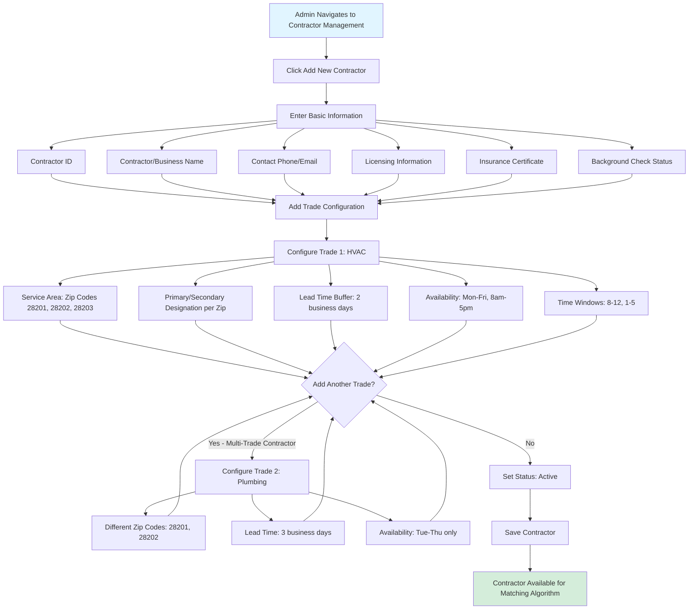
```mermaid
flowchart TD
    A[Admin Navigates to Contractor Management] --> B[Click Add New Contractor]
    B --> C[Enter Basic Information]

    C --> C1[Contractor ID]
    C --> C2[Contractor/Business Name]
    C --> C3[Contact Phone/Email]
    C --> C4[Licensing Information]
    C --> C5[Insurance Certificate]
    C --> C6[Background Check Status]

    C1 --> D[Add Trade Configuration]
    C2 --> D
    C3 --> D
    C4 --> D
    C5 --> D
    C6 --> D

    D --> E[Configure Trade 1: HVAC]
    E --> E1[Service Area: Zip Codes 28201, 28202, 28203]
    E --> E2[Primary/Secondary Designation per Zip]
    E --> E3[Lead Time Buffer: 2 business days]
    E --> E4[Availability: Mon-Fri, 8am-5pm]
    E --> E5[Time Windows: 8-12, 1-5]

    E1 --> F{Add Another Trade?}
    E2 --> F
    E3 --> F
    E4 --> F
    E5 --> F

    F -->|Yes - Multi-Trade Contractor| G[Configure Trade 2: Plumbing]
    F -->|No| H[Set Status: Active]

    G --> G1[Different Zip Codes: 28201, 28202]
    G --> G2[Lead Time: 3 business days]
    G --> G3[Availability: Tue-Thu only]
    G1 --> F
    G2 --> F
    G3 --> F

    H --> I[Save Contractor]
    I --> J[Contractor Available for Matching Algorithm]

    style A fill:#e1f5ff
    style J fill:#d4edda
```

### Scenario B: Edit Existing Contractor Configuration

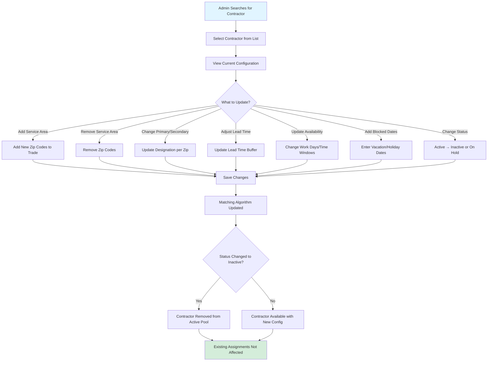
```mermaid
flowchart TD
    A[Admin Searches for Contractor] --> B[Select Contractor from List]
    B --> C[View Current Configuration]

    C --> D{What to Update?}

    D -->|Add Service Area| E1[Add New Zip Codes to Trade]
    D -->|Remove Service Area| E2[Remove Zip Codes]
    D -->|Change Primary/Secondary| E3[Update Designation per Zip]
    D -->|Adjust Lead Time| E4[Update Lead Time Buffer]
    D -->|Update Availability| E5[Change Work Days/Time Windows]
    D -->|Add Blocked Dates| E6[Enter Vacation/Holiday Dates]
    D -->|Change Status| E7[Active → Inactive or On Hold]

    E1 --> F[Save Changes]
    E2 --> F
    E3 --> F
    E4 --> F
    E5 --> F
    E6 --> F
    E7 --> F

    F --> G[Matching Algorithm Updated]
    G --> H{Status Changed to Inactive?}

    H -->|Yes| I[Contractor Removed from Active Pool]
    H -->|No| J[Contractor Available with New Config]

    I --> K[Existing Assignments Not Affected]
    J --> K

    style A fill:#e1f5ff
    style K fill:#d4edda
```

### Scenario C: Emergency Override / Exception Handling

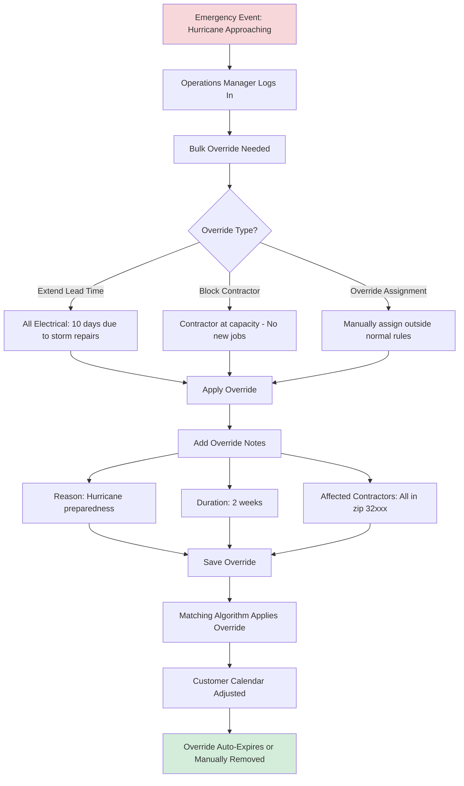
```mermaid
flowchart TD
    A[Emergency Event: Hurricane Approaching] --> B[Operations Manager Logs In]
    B --> C[Bulk Override Needed]

    C --> D{Override Type?}

    D -->|Extend Lead Time| E1[All Electrical: 10 days due to storm repairs]
    D -->|Block Contractor| E2[Contractor at capacity - No new jobs]
    D -->|Override Assignment| E3[Manually assign outside normal rules]

    E1 --> F[Apply Override]
    E2 --> F
    E3 --> F

    F --> G[Add Override Notes]
    G --> G1[Reason: Hurricane preparedness]
    G --> G2[Duration: 2 weeks]
    G --> G3[Affected Contractors: All in zip 32xxx]

    G1 --> H[Save Override]
    G2 --> H
    G3 --> H

    H --> I[Matching Algorithm Applies Override]
    I --> J[Customer Calendar Adjusted]
    J --> K[Override Auto-Expires or Manually Removed]

    style A fill:#f8d7da
    style K fill:#d4edda
```

### Contractor Network Overview

**Network Statistics:**
- Total Contractors: 125-140
- Primary Contractors: 80% (100-112)
- Backup Contractors: 20% (25-28)
- Multi-Trade Contractors: Majority offer 2-3 trades
- Geographic Coverage: 4-5 states (NC, SC, FL, OH, IN)
- Coverage by Trade:
  - HVAC: 99-100%
  - Plumbing: 99-100%
  - Electrical: 99-100%
  - Water Heater: 99-100%
  - Appliance: 95%+

**Key Configuration Rules:**
- Assignment is zip code specific (NOT radius-based)
- Contractors may serve non-contiguous areas (e.g., Charlotte + Raleigh, not cities in between)
- Each trade has different lead time buffers per contractor
- Availability windows vary by trade (e.g., HVAC: Mon-Fri, Plumbing: Tue-Thu only)
- Primary/secondary designation is contractual, not based on dynamic ratings

---

## Cross-Workflow Integration Map

**Shows how workflows interact with each other:**

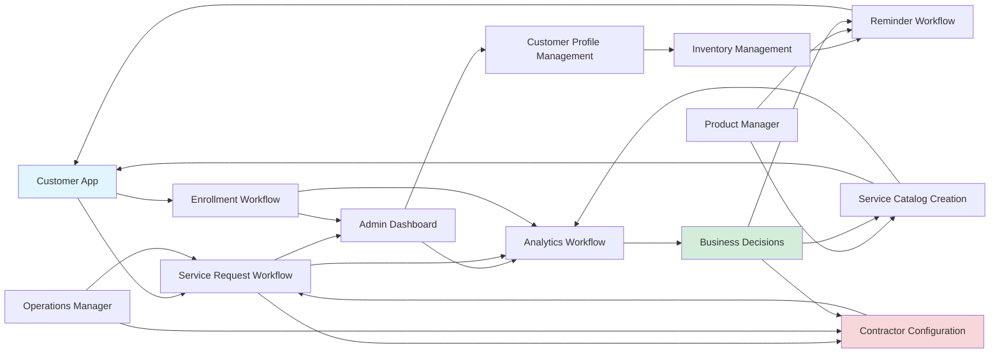
```mermaid
flowchart LR
    A[Customer App] --> B[Service Request Workflow]
    A --> C[Enrollment Workflow]

    B --> D[Admin Dashboard]
    C --> D

    D --> E[Customer Profile Management]
    E --> F[Inventory Management]

    F --> G[Reminder Workflow]
    G --> A

    H[Product Manager] --> I[Service Catalog Creation]
    H --> G

    I --> A

    D --> J[Analytics Workflow]
    B --> J
    C --> J
    I --> J

    B --> L[Contractor Configuration]
    L --> B

    M[Operations Manager] --> L
    M --> B

    J --> K[Business Decisions]
    K --> I
    K --> G
    K --> L

    style A fill:#e1f5ff
    style K fill:#d4edda
    style L fill:#f8d7da
```

**Key Integration Points:**
- **Service Request → Contractor Config**: Matching algorithm uses contractor configuration (trade + zip code + lead time)
- **Operations Manager → Service Request**: Manual processing within 1 hour, contacts contractors
- **Business Decisions → Contractor Config**: Analytics drive contractor network expansion decisions

---

## System Integration Flow

**How admin portal integrates with external systems:**

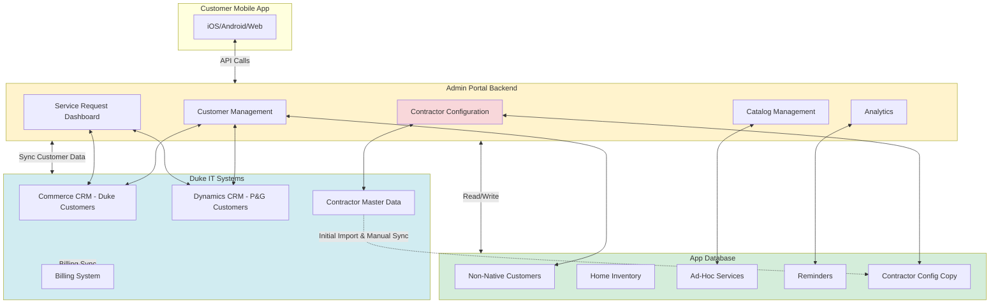
```mermaid
flowchart TB
    subgraph Customer_App[Customer Mobile App]
        CA[iOS/Android/Web]
    end

    subgraph Admin_Portal[Admin Portal Backend]
        AP1[Customer Management]
        AP2[Service Request Dashboard]
        AP3[Catalog Management]
        AP4[Analytics]
        AP5[Contractor Configuration]
    end

    subgraph Duke_Systems[Duke IT Systems]
        DS1[Commerce CRM - Duke Customers]
        DS2[Dynamics CRM - P&G Customers]
        DS3[Billing System]
        DS4[Contractor Master Data]
    end

    subgraph App_Database[App Database]
        DB1[Non-Native Customers]
        DB2[Home Inventory]
        DB3[Ad-Hoc Services]
        DB4[Reminders]
        DB5[Contractor Config Copy]
    end

    CA <-->|API Calls| Admin_Portal

    Admin_Portal <-->|Sync Customer Data| Duke_Systems
    Admin_Portal <-->|Read/Write| App_Database

    Duke_Systems -->|Billing Sync| DS3

    AP1 <--> DS1
    AP1 <--> DS2
    AP1 <--> DB1

    AP2 <--> DS1
    AP2 <--> DS2

    AP3 <--> DB3
    AP4 <--> DB4

    AP5 <--> DS4
    AP5 <--> DB5

    DS4 -.->|Initial Import & Manual Sync| DB5

    style Admin_Portal fill:#fff3cd
    style Duke_Systems fill:#d1ecf1
    style App_Database fill:#d4edda
    style AP5 fill:#f8d7da
```

**Key Integration Notes:**
- **Contractor Configuration**: Admin backend houses local copy of contractor data from CRM
- **Matching Algorithm**: Uses local contractor config for trade + zip code matching
- **MVP Sync Strategy**: Manual sync between CRM and app backend (as-needed, ~1-2 updates/year)
- **Phase 2**: Real-time API to read contractor data from CRM, nightly sync

---

## Decision Tree: Service Request Routing

**How service requests are routed based on customer type and service type:**

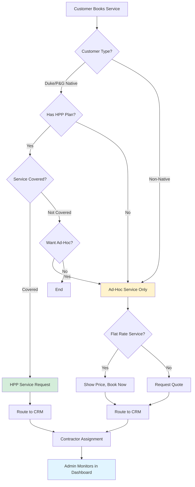
```mermaid
flowchart TD
    A[Customer Books Service] --> B{Customer Type?}

    B -->|Duke/P&G Native| C{Has HPP Plan?}
    B -->|Non-Native| H[Ad-Hoc Service Only]

    C -->|Yes| D{Service Covered?}
    C -->|No| H

    D -->|Covered| E[HPP Service Request]
    D -->|Not Covered| F{Want Ad-Hoc?}

    F -->|Yes| H
    F -->|No| G[End]

    E --> I[Route to CRM]
    H --> J{Flat Rate Service?}

    J -->|Yes| K[Show Price, Book Now]
    J -->|No| L[Request Quote]

    K --> M[Route to CRM]
    L --> M

    I --> N[Contractor Assignment]
    M --> N

    N --> O[Admin Monitors in Dashboard]

    style E fill:#d4edda
    style H fill:#fff3cd
    style O fill:#e1f5ff
```

---

## Admin Permission Levels

**Visual representation of role-based access:**

```mermaid
flowchart TD
    A[Admin User Logs In] --> B{Role?}

    B -->|Super Admin| C[Full Access to All Modules]
    B -->|Back Office Admin| D[Customer Management + Operations]
    B -->|Product Manager| E[Catalog + Reminders + Analytics Read]
    B -->|Operations Manager| F[Service Dashboard + Contractor Config]
    B -->|CSR Support| G[Customer Profiles + Password Resets]
    B -->|CSR Enrollment| H[Enrollment Queue Only]
    B -->|Analyst| I[Analytics Dashboards Read-Only]

    C --> C1[✅ Customer CRUD]
    C --> C2[✅ Service Management]
    C --> C3[✅ Catalog Management]
    C --> C4[✅ User Management]
    C --> C5[✅ Analytics]

    D --> D1[✅ Customer CRUD]
    D --> D2[✅ Inventory Management]
    D --> D3[✅ Service Requests View/Edit]
    D --> D4[❌ Catalog Management]

    E --> E1[✅ Create/Edit Services]
    E --> E2[✅ Set Pricing]
    E --> E3[✅ Create Reminders]
    E --> E4[📖 Analytics Read-Only]
    E --> E5[❌ Customer Data Edit]

    F --> F1[✅ Service Dashboard Full]
    F --> F2[✅ Reassign Contractors]
    F --> F3[✅ Contractor Config CRUD]
    F --> F4[✅ Manual Service Request Processing]
    F --> F5[✅ Contractor Availability Overrides]
    F --> F6[📖 Customer View-Only]

    G --> G1[✅ Customer Profile View]
    G --> G2[✅ Password Resets]
    G --> G3[✅ Unlock Accounts]
    G --> G4[❌ Edit Inventory]
    G --> G5[❌ Service Management]

    H --> H1[✅ Enrollment Queue]
    H --> H2[✅ Create Business Partner]
    H --> H3[📖 Customer View-Only]

    I --> I1[📖 All Dashboards]
    I --> I2[✅ Export Reports]
    I --> I3[❌ Edit Anything]

    style C fill:#d4edda
    style I fill:#e1f5ff
```

**Legend:**
- ✅ = Full Access (Create, Read, Update, Delete)
- 📖 = Read-Only Access
- ❌ = No Access

---

## Data Flow: Customer Enrollment (MVP with Manual Fallback)

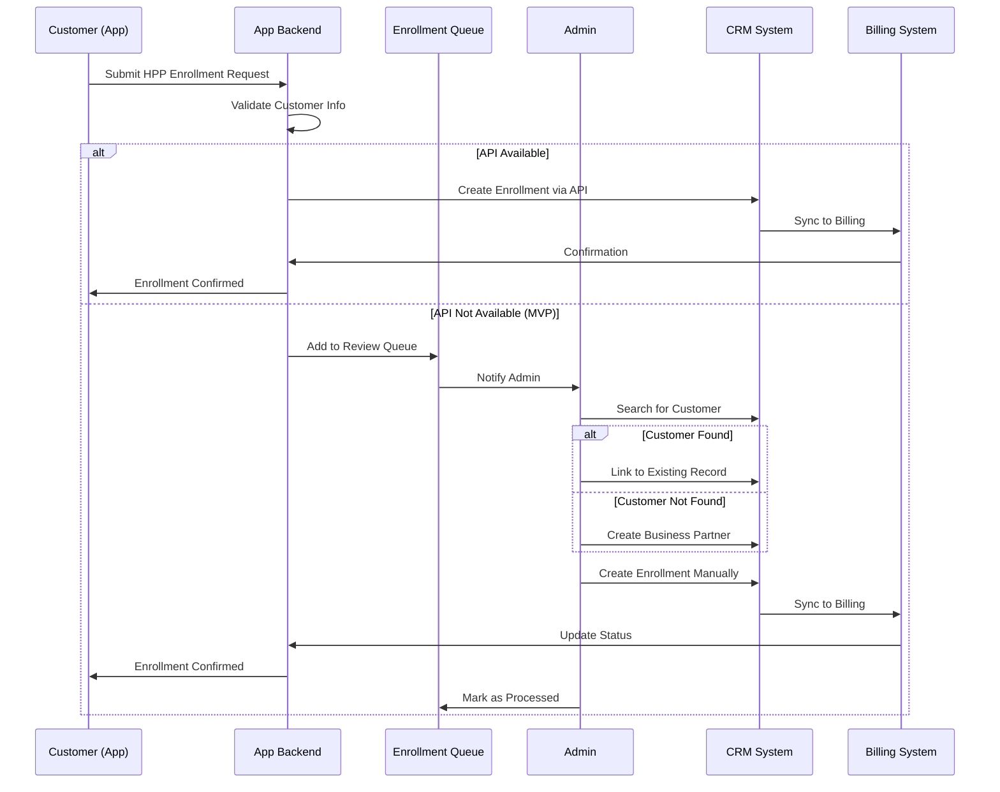
```mermaid
sequenceDiagram
    participant C as Customer (App)
    participant AB as App Backend
    participant Q as Enrollment Queue
    participant A as Admin
    participant CRM as CRM System
    participant B as Billing System

    C->>AB: Submit HPP Enrollment Request
    AB->>AB: Validate Customer Info

    alt API Available
        AB->>CRM: Create Enrollment via API
        CRM->>B: Sync to Billing
        B->>AB: Confirmation
        AB->>C: Enrollment Confirmed
    else API Not Available (MVP)
        AB->>Q: Add to Review Queue
        Q->>A: Notify Admin
        A->>CRM: Search for Customer
        alt Customer Found
            A->>CRM: Link to Existing Record
        else Customer Not Found
            A->>CRM: Create Business Partner
        end
        A->>CRM: Create Enrollment Manually
        CRM->>B: Sync to Billing
        B->>AB: Update Status
        AB->>C: Enrollment Confirmed
        A->>Q: Mark as Processed
    end
```

**Timeline:**
- API available: Immediate (< 1 minute)
- Manual fallback: 24-48 hours

---

## Exception Handling Flow

**What happens when things go wrong:**

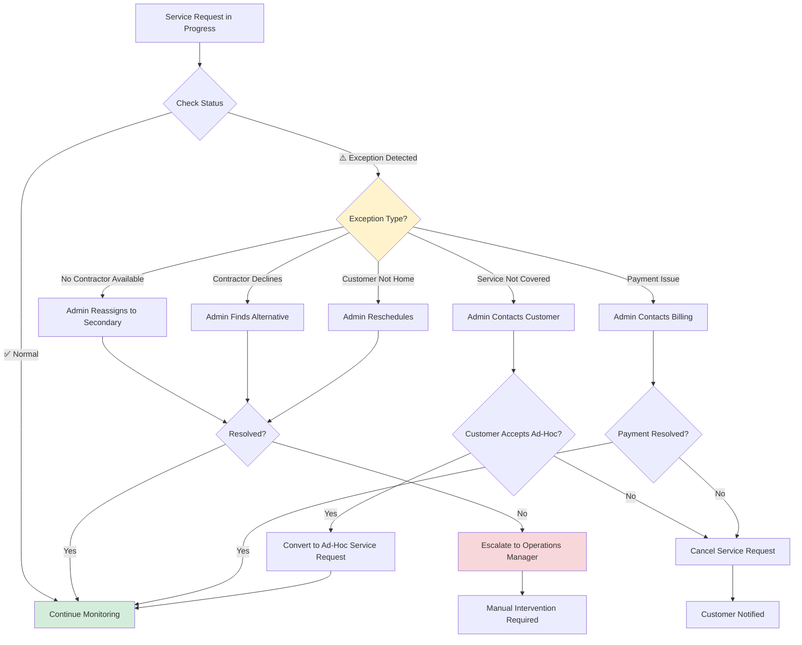
```mermaid
flowchart TD
    A[Service Request in Progress] --> B{Check Status}

    B -->|✅ Normal| Z[Continue Monitoring]
    B -->|⚠️ Exception Detected| C{Exception Type?}

    C -->|No Contractor Available| D[Admin Reassigns to Secondary]
    C -->|Contractor Declines| E[Admin Finds Alternative]
    C -->|Customer Not Home| F[Admin Reschedules]
    C -->|Service Not Covered| G[Admin Contacts Customer]
    C -->|Payment Issue| H[Admin Contacts Billing]

    D --> I{Resolved?}
    E --> I
    F --> I
    G --> J{Customer Accepts Ad-Hoc?}
    H --> K{Payment Resolved?}

    I -->|Yes| Z
    I -->|No| L[Escalate to Operations Manager]

    J -->|Yes| M[Convert to Ad-Hoc Service Request]
    J -->|No| N[Cancel Service Request]

    K -->|Yes| Z
    K -->|No| N

    M --> Z
    L --> O[Manual Intervention Required]
    N --> P[Customer Notified]

    style C fill:#fff3cd
    style L fill:#f8d7da
    style Z fill:#d4edda
```

---

## MVP vs Phase 2 Features

**Visual roadmap of admin features:**

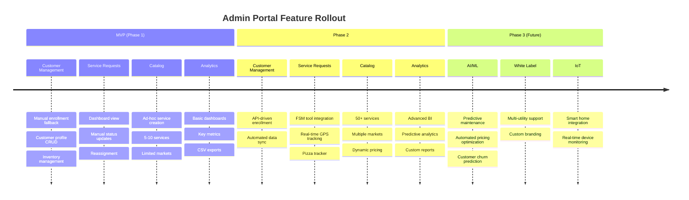
```mermaid
timeline
    title Admin Portal Feature Rollout

    section MVP (Phase 1)
        Customer Management : Manual enrollment fallback
                           : Customer profile CRUD
                           : Inventory management
        Service Requests : Dashboard view
                        : Manual status updates
                        : Reassignment
        Catalog : Ad-hoc service creation
               : 5-10 services
               : Limited markets
        Analytics : Basic dashboards
                 : Key metrics
                 : CSV exports

    section Phase 2
        Customer Management : API-driven enrollment
                           : Automated data sync
        Service Requests : FSM tool integration
                        : Real-time GPS tracking
                        : Pizza tracker
        Catalog : 50+ services
               : Multiple markets
               : Dynamic pricing
        Analytics : Advanced BI
                 : Predictive analytics
                 : Custom reports

    section Phase 3 (Future)
        AI/ML : Predictive maintenance
             : Automated pricing optimization
             : Customer churn prediction
        White Label : Multi-utility support
                   : Custom branding
        IoT : Smart home integration
           : Real-time device monitoring
```

---

## Summary: Key Takeaways

### **8 Core Admin Workflows:**
1. ✅ Manual enrollment processing (MVP fallback when API doesn't exist)
2. ✅ Service request management with manual contractor coordination (CRITICAL MVP WORKFLOW - admin contacts contractors within 1 hour)
3. ✅ Ad-hoc service catalog creation (new product offerings)
4. ✅ Reminder management (proactive customer engagement)
5. ✅ Customer profile management (support calls, troubleshooting)
6. ✅ Inventory management (multi-source data entry)
7. ✅ Analytics review (data-driven business decisions)
8. ✅ Contractor configuration management (NEW from Session 3 - multi-trade, zip code based matching, lead time buffers)

### **Critical Success Factors:**
- **Manual service request processing for MVP** - Operations Manager manually contacts contractors within 1 hour SLA, updates app based on contractor responses (24-48 hour total confirmation time)
- **Contractor configuration management** - Admin backend houses local copy of 125-140 contractors with multi-trade support, zip code based matching (NOT radius), trade-specific lead time buffers
- **Manual fallbacks for MVP** - When APIs don't exist, admins process via queues
- **Cross-system aggregation** - Admin portal as "middle layer" between CRM and app
- **Multi-level permissions** - Different roles see different data/functions
- **Full instrumentation** - Analytics critical from day 1 for business case validation
- **No FSM integration for MVP** - No real-time GPS tracking, contractor mobile app, or automated status updates

### **Next Steps:**
1. Review workflows with Duke team for accuracy (especially new Workflow 8 - Contractor Configuration)
2. Create detailed wireframes for each admin screen (23+ screens - added contractor management screens)
3. Define API specifications for Duke IT integrations (including contractor data sync requirements)
4. Document manual fallback processes for MVP (especially manual service request processing workflow)
5. Define contractor data import/export specifications for initial setup and ongoing sync

---

**Document Owner:** Orases Product Management Team
**Created:** November 19, 2025
**Last Updated:** November 22, 2025
**Status:** Updated and synced with Admin Portal Preliminary Scope document - Ready for wireframe design

**Related Documents:**
- [Admin Portal Preliminary Scope](Admin_Portal_Preliminary_Scope.md) - **SYNCED** (Updated November 22, 2025)
- [Customer App Preliminary Scope & Flows](Customer_App_Preliminary_Scope_and_Flows.md)

**Changelog:**
- **November 22, 2025**: Major update to sync with expanded Admin Portal Preliminary Scope
  - Updated Workflow 2 with manual service request processing details (Session 3 insights)
  - Added NEW Workflow 8: Contractor Configuration Management
  - Updated System Integration Flow with contractor data
  - Enhanced Admin Permission Levels for Operations Manager role
  - Updated Cross-Workflow Integration Map
  - Added document update summary section
- **November 19, 2025**: Initial document creation
